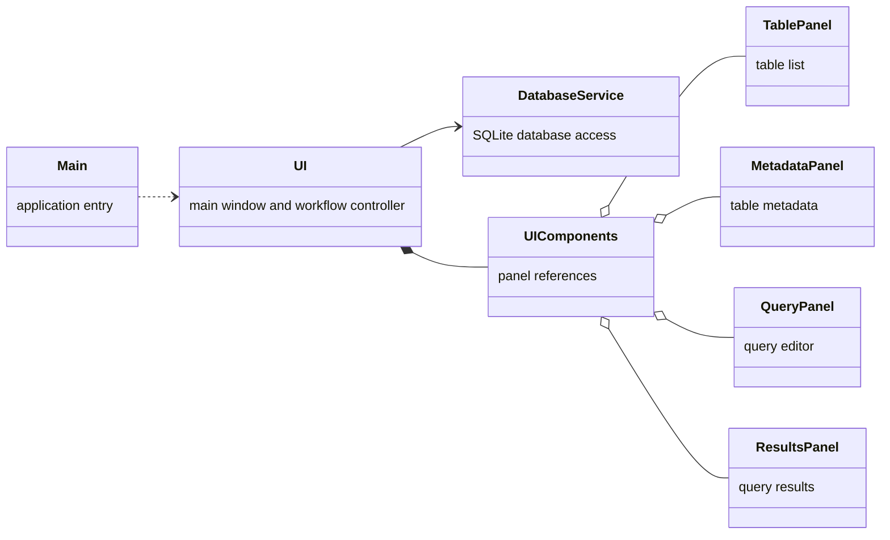

# Architecture

```mermaid
classDiagram
direction LR

class Main {
  application entry
}

class UI {
  main window and workflow controller
}

class DatabaseService {
  SQLite database access
}

class TablePanel {
  table list
}

class MetadataPanel {
  table metadata
}

class QueryPanel {
  query editor
}

class ResultsPanel {
  query results
}

class UIComponents {
  panel references
}

Main ..> UI
UI *-- UIComponents
UI --> DatabaseService
UIComponents o-- TablePanel
UIComponents o-- MetadataPanel
UIComponents o-- QueryPanel
UIComponents o-- ResultsPanel
```
