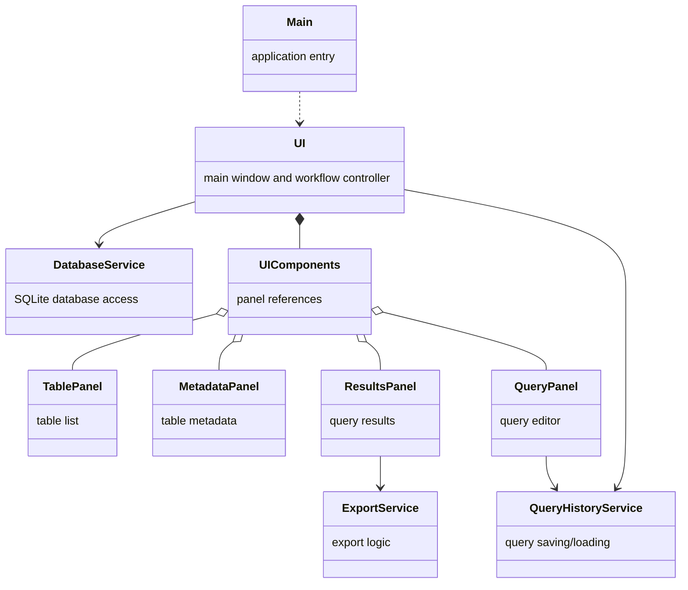
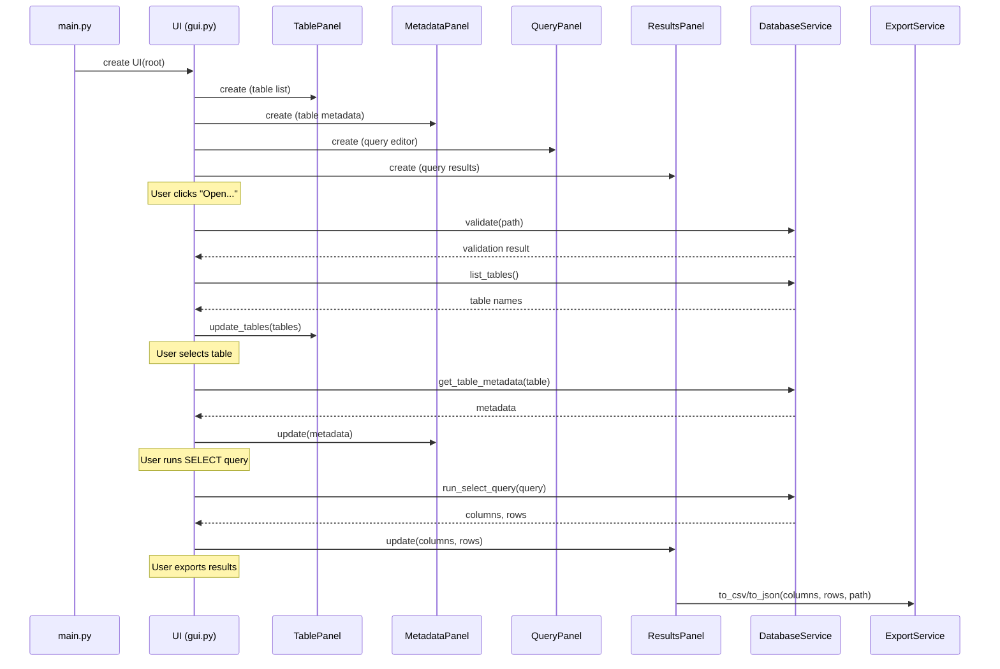

# Architecture

## High-Level Structure

The project is organized into a few clear parts:

- `main.py`: Starts the program. Sets up the main window and launches the UI.
- `ui/`: Contains the user interface components.
  - `gui.py`: Manages the main window and overall workflow. This is where the UI panels and services are created and connected.
  - `components/`: All the main UI panels live here:
    - `TablePanel`: Shows the list of tables in the database.
    - `MetadataPanel`: Displays column info for the selected table and whole database schema.
    - `QueryPanel`: Lets the user write and run SELECT queries.
    - `ResultsPanel`: Shows query results and lets you export them.
    - `TreePanel`: Shared helper for tree-style views.
- `services/`: Handles the actual logic and database work:
  - `DatabaseService`: Checks the SQLite database, lists tables, fetches metadata, and runs queries.
  - `ExportService`: Exports data to CSV and JSON files.
  - `QueryHistoryService`: Saves and loads previous queries for convenience.

## Application Logic

1. Startup: The program begins in main.py, which creates the Tkinter window and the UI object.
2. UI: The UI sets up all the panels: tables, metadata, query editor, and results.
3. Open Database: The user picks a database file. The UI asks DatabaseService to check the file and list the tables.
4. Select Table: When a table is selected, the UI fetches its metadata and updates the MetadataPanel.
5. Run Query: The user writes a SELECT query and runs it. The UI gets the results from DatabaseService and updates the ResultsPanel.
6. Export Results: Results can be exported to CSV or JSON. The ResultsPanel uses ExportService for this.

## Class Diagram

## Application Sequence

