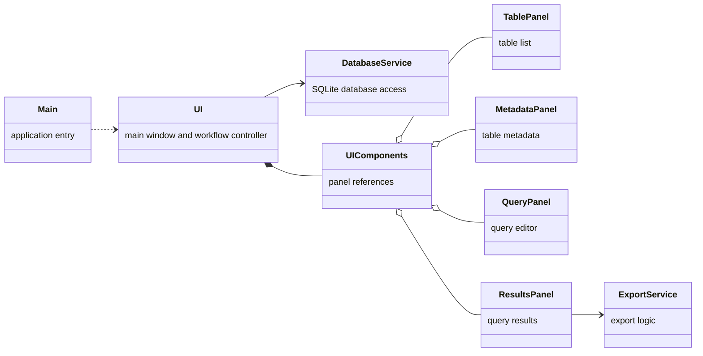
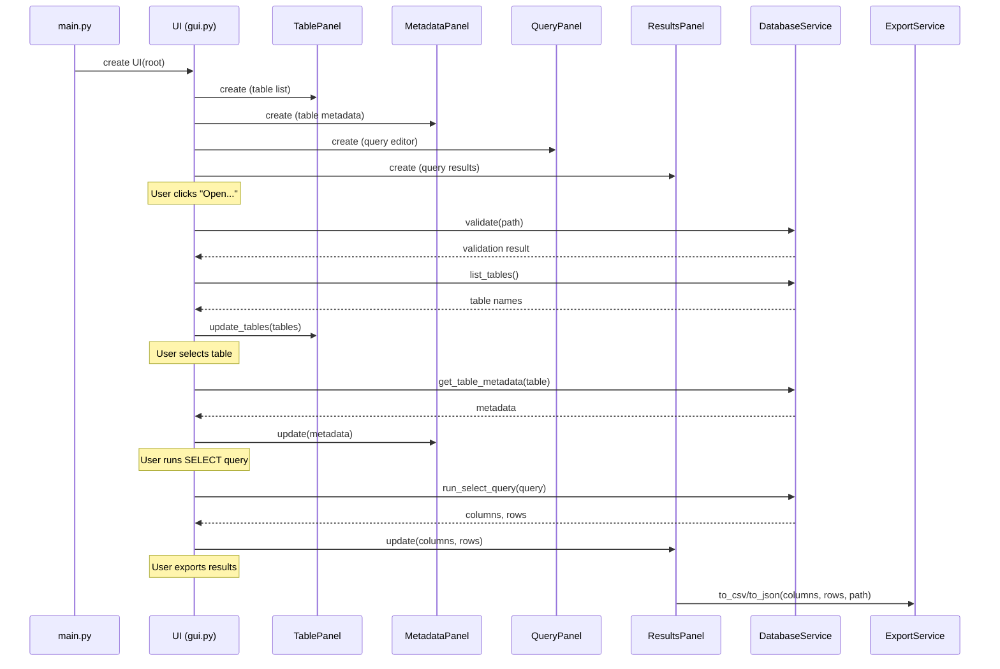

# Architecture

```mermaid
classDiagram
direction LR

class Main {
  application entry
}

class UI {
  main window and workflow controller
}

class DatabaseService {
  SQLite database access
}

class ExportService {
  export logic
}

class TablePanel {
  table list
}

class MetadataPanel {
  table metadata
}

class QueryPanel {
  query editor
}

class ResultsPanel {
  query results
}

class UIComponents {
  panel references
}

Main ..> UI
UI *-- UIComponents
UI --> DatabaseService
UIComponents o-- TablePanel
UIComponents o-- MetadataPanel
UIComponents o-- QueryPanel
UIComponents o-- ResultsPanel
ResultsPanel --> ExportService
```

## Application Sequence

```mermaid
sequenceDiagram
  participant Main as main.py
  participant UI as UI (gui.py)
  participant TablePanel as TablePanel
  participant MetadataPanel as MetadataPanel
  participant QueryPanel as QueryPanel
  participant ResultsPanel as ResultsPanel
  participant DatabaseService as DatabaseService
  participant ExportService as ExportService

  Main->>UI: create UI(root)
  UI->>TablePanel: create (table list)
  UI->>MetadataPanel: create (table metadata)
  UI->>QueryPanel: create (query editor)
  UI->>ResultsPanel: create (query results)

  Note over UI: User clicks "Open..."
  UI->>DatabaseService: validate(path)
  DatabaseService-->>UI: validation result
  UI->>DatabaseService: list_tables()
  DatabaseService-->>UI: table names
  UI->>TablePanel: update_tables(tables)

  Note over UI: User selects table
  UI->>DatabaseService: get_table_metadata(table)
  DatabaseService-->>UI: metadata

  UI->>MetadataPanel: update(metadata)
  Note over UI: User runs SELECT query

  UI->>DatabaseService: run_select_query(query)
  DatabaseService-->>UI: columns, rows
  UI->>ResultsPanel: update(columns, rows)

  Note over UI: User exports results
  ResultsPanel->>ExportService: to_csv/to_json(columns, rows, path)
```
