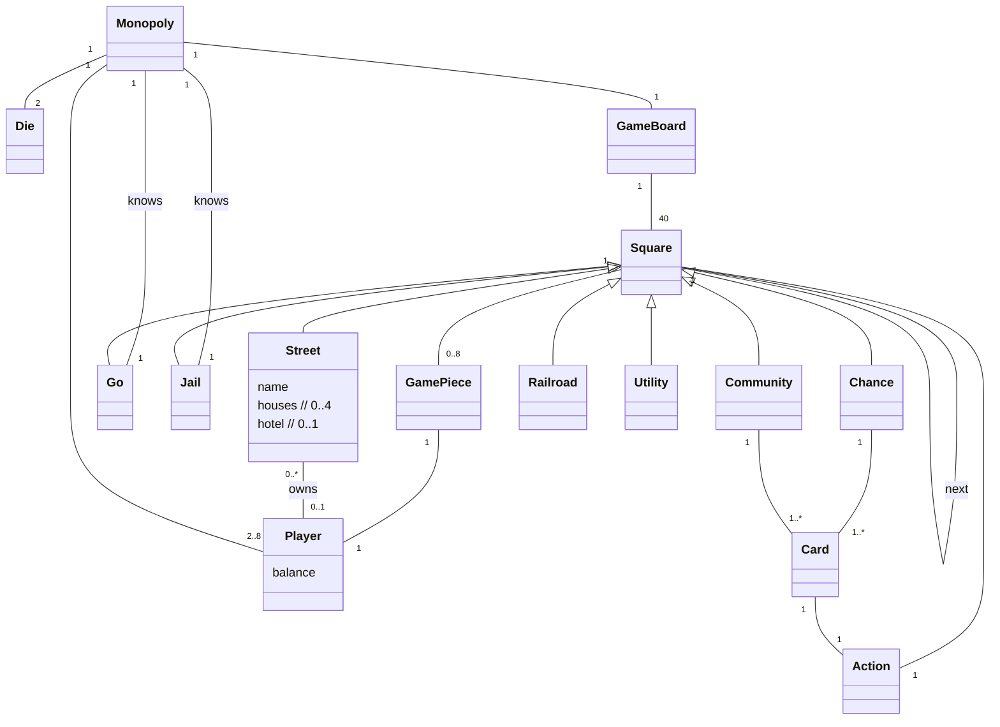
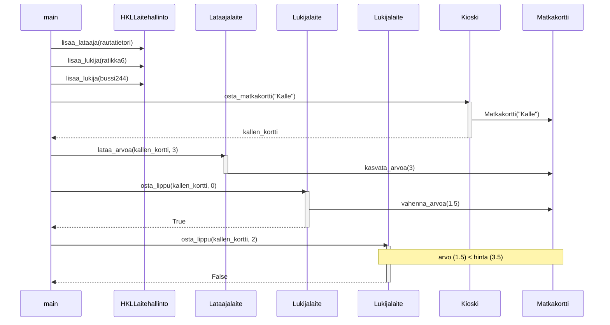

# Exercise 1: Monopoly

```mermaid
classDiagram
    Monopoly "1" -- "2" Die
    Monopoly "1" -- "1" GameBoard
    GameBoard "1" -- "40" Square
    Square "1" -- "1" Square : next
    Square "1" -- "0..8" GamePiece
    GamePiece "1" -- "1" Player
    Player "2..8" -- "1" Monopoly

    Monopoly "1" -- "1" Go : knows
    Monopoly "1" -- "1" Jail : knows
    Square "1" -- "1" Action

    Square <|-- Go
    Square <|-- Jail
    Square <|-- Chance
    Square <|-- Community
    Square <|-- Railroad
    Square <|-- Utility
    Square <|-- Street

    Chance "1" -- "1..*" Card
    Community "1" -- "1..*" Card
    Card "1" -- "1" Action

    Street "0..*" -- "0..1" Player : owns

    class Player {
        balance
    }

    class Street {
        name
        houses // 0..4
        hotel // 0..1
    }
```

# Exercise 2: Sequence Diagram

```mermaid
sequenceDiagram
    participant main
    participant laitehallinto as HKLLaitehallinto
    participant rautatietori as Lataajalaite
    participant ratikka6 as Lukijalaite
    participant bussi244 as Lukijalaite
    participant lippu_luukku as Kioski
    participant kallen_kortti as Matkakortti

    main->>laitehallinto: lisaa_lataaja(rautatietori)
    main->>laitehallinto: lisaa_lukija(ratikka6)
    main->>laitehallinto: lisaa_lukija(bussi244)

    main->>lippu_luukku: osta_matkakortti("Kalle")
    activate lippu_luukku
    lippu_luukku->>kallen_kortti: Matkakortti("Kalle")
    lippu_luukku-->>main: kallen_kortti
    deactivate lippu_luukku

    main->>rautatietori: lataa_arvoa(kallen_kortti, 3)
    activate rautatietori
    rautatietori->>kallen_kortti: kasvata_arvoa(3)
    deactivate rautatietori

    main->>ratikka6: osta_lippu(kallen_kortti, 0)
    activate ratikka6
    ratikka6->>kallen_kortti: vahenna_arvoa(1.5)
    ratikka6-->>main: True
    deactivate ratikka6

    main->>bussi244: osta_lippu(kallen_kortti, 2)
    activate bussi244
    Note over bussi244, kallen_kortti: arvo (1.5) < hinta (3.5)
    bussi244-->>main: False
    deactivate bussi244
```
